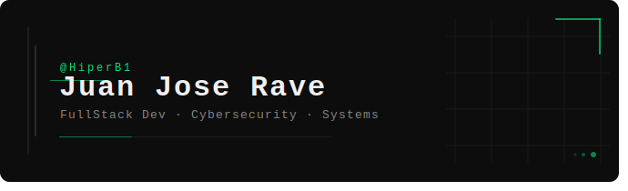

<!-- Banner – exporta el SVG desde Claude y súbelo a tu repo como banner.svg -->

  

 
<!-- Intro -->

  <samp>
    <b>Hola, soy Juan Jose.</b> Construyo interfaces, sistemas y exploro seguridad. 
    Código limpio, mente curiosa, terminal siempre abierta.
  </samp>

 

 
